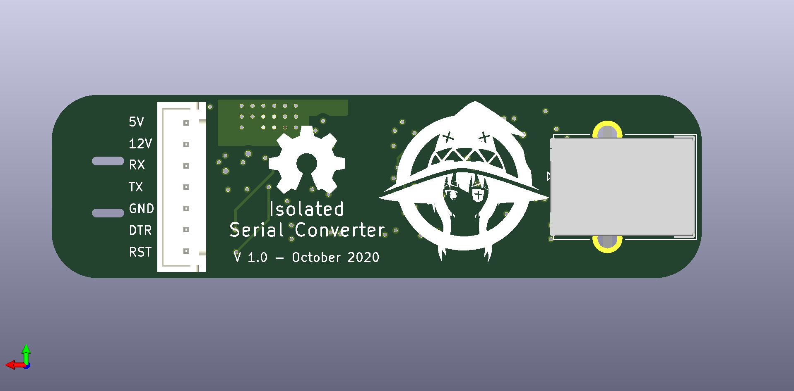

# EQMOD Direct - Isolated Serial to USB board

This is a KiCad PCB for an isolated UART to USB board.
It can be used as isolated EQDIRECT board to connect to your HEQ5 or EQ6 astronomical mount.
It can also be used as a generic, isolated UART converter board, with optional DTR and RTS lines.

If you want to make your own, or order one from JLC PCB, you can find details and the needed files below.
I also have some extra boards (both assembled and bare PCB), that I sell, at pretty much the manufacturing price. You will only need to add a USB cable, and the cable from your mount to the board (again, details below).

Price is around 10 euros assembled, and a few euros for the bare PCBs, plus shipping (shipping from Italy).
For more details, contact me at:

16009140+claudioarena@users.noreply.github.com

## Overview

The board was inspired by [this project](https://olegkutkov.me/2018/02/14/isolated-eqmod-adapter-telescope-control/).

The board uses an FT232RL IC for the serial to USB conversion, and AdUM1201AR for the isolation.
The board also has appropriate diodes for ESD protection on the USB and UART connections.
There are also some PTC/Fuse protections, and USB power filtering included.

The board can easily be used on a HEQ5, EQ6 and similar astronomy mounts, to enable pc control.
In this respect, it behaves like an EQDIRECT cable, but with extra isolations and protections.
The board can also be used, thanks to an optional AdUM1200AR, as a generic isolated UART converter board. The second isolator breaks out the DTR and RST lines.

This, together with the broken out connector, can allow the board to be used, for example, with an Arduino or an ESP32 board, were full isolation is needed.

## Using with an HEQ5/EQ6

Please refer to [this page](http://eq-mod.sourceforge.net/eqdirect2.htm) for connection details.
You want to connect the Tx pin on the board to the Rx pin on the mount, and the Rx pin on the board to the Tx pin on the mount.

Once you have connected Tx, Rx, GND and 12V from the mount to the board, and a USB cable from your PC to the board, it should all just works. The PC should remember the COM port (i.e. COM port number shouldn't change), and Windows 10 should download the appropriate drivers automatically.

## Schematics

The schematics of the board is composed of two parts, separated by the isolator chips.
On the left, we can see the USB connector and the protection diodes IC. The USB lines are then connected to the FT232RL IC. The USB 5V line is fused, filtered, and provides power to the whole left side of the board (USB side of the isolator).

The signals are then fed to the isolator chips. On the UART side of the board, we can also see a 5V regulator. This takes the 12V from the mount (or other equipment), and regulates it down to 5V for the isolator chip. This is also fused and regulated. Note that there are fuses on both the 5V and 12V lines.

The idea here is to use the board in a few possible ways:
- Provide 12V to the board on the UART side. You can then use the 5V as an output. However, the 5V regulator use can only provide very little current, so be careful. In this case, the UART will be 5V logical level.
- Provide 5V to the board on the UART side. In this can, you can leave the regulator, its protection fuse and levelling capacitor unpopulated.
- Provide a different voltage level (e.g. 3.3V) to the UART side, using the 5V connection. Provided that this is within the acceptable range of the isolator chips, this can be used to give you a different voltage levels UART.

There are also 4 indicator LEDs. Two of them indicate if power if present on either side of the board (USB power and 5V or 12V connection on the UART side). The other 2 LEDs are connected to CBUS0 and CBUS1 on the FT232RL IC. Those line normally indicate activity on the Tx and Rx line.

## PCB Images

## Make your own board

You can use the following gerber, bom and assembly files to order yourself from JLC PCB:

[gerber-jlc.zip](gerber/gerber-jlc.zip)

[EQMOD_DIRECT_Isolated-jlc.csv](bom/EQMOD_DIRECT_Isolated-jlc.csv)

[EQMOD_DIRECT_Isolated-top-jlcpcb.csv](assembly/EQMOD_DIRECT_Isolated-top-jlcpcb.csv)

If you order yourself, PLEASE VERIFY EVERYTHING LOOKS AS YOU EXPECT.
With the above files, you should get all IC correctly rotated and populated.
But maybe there are some part shortages, or part order number changed since writing this. So, double check.

The above files for assembly, are missing a few ICs.
First of all, it's missing the second isolator IC. It's a relatively expensive parts, and not needed for EQ6 boards. IF you need it, you can solder it later yourself, or add it to the assembly files.

It's also missing the fuses. You need to select yourself if you want normal fuses or Polyfuse, and of which trip current. It's also missing the inductor/ferrite bead for USB power filtering.
Again, here you need to choose which value you want.
Schematic values are, in my opinion, reasonable values, but you are free to tweak them. Easy enough to solder them after the assembly process.

You might also want to tweak the value of the LED resistor. The default 3.3k are quite bright.
For a very dim, night use, astronomy friendly LEDs, try 100k instead. 

Finally, you can both solder the USB and UART connectors, or solder wires directly to the board. There are slots cut into the PCB, if you want to solder wire directly, to add some strain relief using some zip ties.

## Testing the board

If you want to make sure your board works as expected, and works in many many different scenarios, I've written a simple script to stress test the device.
Check it out [here](https://github.com/claudioarena/Serial_stress_test).

Simply short out the Tx and Rx line on the board (so that messages sent from the board are received back), and power the UART side of the board from an external supply (either 12V or 5V connection).

The python script will run through a combinations of different serial Baud rates, and check with various lengths of random strings to see if the received messages match the outgoing ones.

